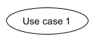

# 简答题
## 1. 用例的概念
用例（use case）就是一组相关的成功和失败场景集合，用来描述参与者如何使用系统来实现其目标。

## 2. 用例和场景的关系？什么是主场景或happy path？
- 用例和场景的关系  
每个用例提供了一个或多个场景，该场景说明了系统是如何和最终用户或其它系统互动，也就是谁可以用系统做什么，从而获得一个明确的业务目标。
- 主场景也被称为 happy path，是系统主要的交互，通常是成功的场景，是最常用的直接地实现用户目标的场景。

## 3. 用例有哪些形式？
- Brief（high level）： 简短的一段总结，通常是主要的成功场景；在早期需求分析过程中，快速了解主题和范围；可能只需用几分钟来创建。
- Casual（简便格式）： 非正式的段落格式；覆盖多个场景的几个段落；在早期需求分析过程中，快速了解主题和范围。
- Fully： 所有的步骤和变化都写得很详细，以及先决条件和成功保障等支撑部分；所有的用户样例都已经确定且简略写完后，在第一个需求研讨会期间，一些（例如10%）架构上重要的和高价值的用例需要被详细地编写。

## 4. 对于复杂业务，为什么编制完整用例非常难？
复杂业务的场景较多，场景较为复杂。在前期的考虑中，很难不遗漏一些业务条件和需求，且这些需求条件还可能发生变化。所以对于复杂业务，编制完整用例且不遗漏情景、良好地安排每个场景、场景内元素地关系非常困难。

## 5. 什么是用例图？
用例图是描述系统与其他外部系统以及用户之间交互的图形，即用例图描述了谁将使用系统，用户希望以什么方式与系统交互。用例图确定系统中所包含的参与者、用例和两者之间的对应关系， 它描述的是关于系统功能的一个概述， 描述软件应具备哪些功能模块以及这些模块之间的调用关系。 用例图包含了用例和参与者， 用例之间用关联来连接以求把系统的整个结构和功能反映给非技术人员（通常是软件的用户）。

## 6. 用例图的基本符号与元素？
参与者（Actor）： 表示的是一个系统用户，也就是与应用程序进行交互的用户、组织或外部系统。  
  

用例（Use Case）： 表示的是对系统提供的功能、服务的一种描述。  
  

包含关系（Include）： 表示用例可以简单地包含其他用例所具有的行为，并把它所包含的用例行为作为自身行为的一部分。  
  

泛化关系（Generalization）： 泛化指的是一个父用例可以被特定化形成多个子用例，而父用例和子用例之间的关系就是泛化关系。  
  

关联关系（Association）： 表示的是参与者与用例之间的关系。  
  

扩展/延伸关系（Extend）： 表示在一定条件下，把新的行为加入到已有的用例中，获得的新用例叫做扩展用例，原有的用例叫做基础用例，相当于为基础用例提供一个附加功能。  
  

## 7. 用例图的画法与步骤
1. 确定参与者，包括:
    - 主要参与者：谁将使用系统的主要功能、谁将需要系统的支持以完成工作等
    - 协作参与者：谁将提供对应的系统功能、谁将维护系统，保证系统处于工作状态等
    - 幕后参与者：谁会对系统产生的结果感兴趣
    - 根据用户需求识别和创作用例，主要重点在于：
2. 识别使用系统的主要参与者（primary actors）/角色(roles)
3. 识别系统依赖的外部系统
4. 识别用例（服务）
5. 识别用户级别用例（user goal level）
6. 识别子功能级别的用例（sub function level）
7. 建立 Actor 和 Use Cases 之间的关联。

## 8. 用例图给利益相关人与开发者的价值有哪些？
- 对于利益相关人：
    - 可以直观看到系统的结果和用户的功能体验，保证系统按照用户的需求进行设计。
    - 用例能够根据需要对复杂程度和形式化程序进行增减调节，即能够响应用户（利益相关人)提出的需求，而用例图则使得这种调节更加便利，可以通过修改图形间的关系实现。
- 对于开发者来说：
    - 用例图是设计者设计过程的结论与参考，设计者与开发者之间的交流工具，开发者开发过程的蓝图。
    - 用例图使得开发者能够更明确地获得需求，更好地理解需求。
    - 用例图可以指导开发和测试，同时可以在整个过程中对其他工作流起到指导作用。

# 建模练习题（用例模型）
## 选择2-3个你熟悉的类似业务的在线服务系统（或移动 APP），如定旅馆（携程、去哪儿等）、定电影票、背单词APP等，分别绘制它们用例图。并满足以下要求：
- 请使用用户的视角，描述用户目标或系统提供的服务
- 粒度达到子用例级别，并用 include 和 exclude 关联它们
- 请用色彩标注出你认为创新（区别于竞争对手的）用例或子用例
- 尽可能识别外部系统和服务
  
  

## 然后，回答下列问题：
1. 为什么相似系统的用例图是相似的？
    因为相似系统的用户人群大致相同，需求也大致相同，所以使得相似系统的业务逻辑也基本相同，因此参与者与用例也会相似，最后呈现出来的用例图也会相似。
2. 如果是定旅馆业务，请对比 Asg_RH 用例图，简述如何利用不同时代、不同地区产品的用例图，展现、突出创新业务和技术
    非定旅馆业务。
3. 如何利用用例图定位创新思路（业务创新、或技术创新、或商业模式创新）在系统中的作用
    因为用例图较为简洁地提出了用户目标（因为每个用例的划分就是对于实现每个大目标以及小目标的划分），因而已经实现的用户目标清晰可见，更方便联想用户的潜在需求。然后可以通过在用户实现这一目标的路径（用例之间的包含关系其实就是用户在实现这一目标所需要的一系列操作）之中加入创新点，以满足用户的潜在需求。
4. 请使用 SCRUM 方法，选择一个用例图，编制某定旅馆开发的需求（backlog）开发计划表  

ID|	Name|   Imp|    Est(man-day)|   How to demo|    Notes  
-|-|-|-|-|-  
1|	登录系统|	7|  3|	账号登录|   关联支付宝或微信账号  
2|  搜索酒店|	10|	10|	输入地段、日期、星级、价格，搜索酒店|	要提供以各种方式对搜索结果进行排序，如距离、价格、评分等  
3|	预订酒店|	9|	8|	查看酒店各种信息，确认房型等|	注意显示房间是否空闲  
4|	确认订单|	6|	4|	确认各种预订信息，如房型、日期等|	提醒用户确认信息  
5|	支付|       8|	5|	选择多种方式支付订单|	关联支付宝、微信、银行卡，考虑各种支付失败的情况  

5. 根据任务4，参考 使用用例点估算软件成本，给出项目用例点的估算  
根据用户点方法，对用例分配权重的标准是：
    - 简单用例：1到3个事务，权重=5
    - 一般用例：4到7个事务，权重=10
    - 复杂用例：多于7个事务，权重=15

用例|	事务|	计算|	原因|	UC权重  
-|-|-|-|-  
登录系统|	2|	2|	两种登录方式|	简单  
搜索酒店|	8|	5|	筛选条件较多|	复杂  
预订酒店|	6|	4|	酒店信息多样|	平均  
确认订单|	3|	2|	功能简单|	简单  
支付|	5|	3|	多种支付方式|	平均  
